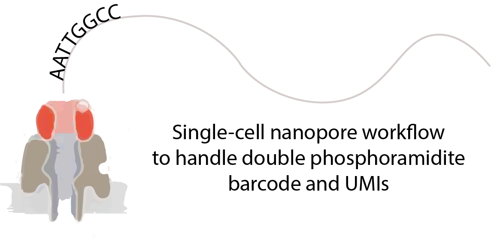

Overview
========

Droplet-based single-cell sequencing techniques have provided unprecedented insight into cellular heterogeneities within tissues. However, these approaches only allow for the measurement of the distal parts of a transcript following short-read sequencing. Therefore, splicing and sequence diversity information is lost for the majority of the transcript. The application of long-read Nanopore sequencing to droplet-based methods is challenging because of the low base-calling accuracy currently associated with Nanopore sequencing. Although several approaches that use additional short-read sequencing to error-correct the barcode and UMI sequences have been developed, these techniques are limited by the requirement to sequence a library using both short- and long-read sequencing. Here we introduce a novel approach termed single-cell Barcode UMI Correction sequencing (scBUC-seq) to efficiently error-correct barcode and UMI oligonucleotide sequences synthesized by using blocks of dimeric nucleotides.

TallyNN is a collection of single-cell workflows that allow users to perform barcode and UMI correction
for oligonucleotide sequences that are synthesised using double phosphoramidites for droplet based
single-cell sequencing.

Workflows
=========

Included within this repo are three workflows:

* pipeline_nanopore - a workflow that facilitates the analysis of nanopore single-cell sequencing data. 
* pipeline_illumina - this is a workflow that processes dinucleotide block single-celdata that has been illumina sequenced. The workflow takes as an input a fastq file and collapses barcode and UMI so that users can procedd their sequencing data using kallisto bustools.
* pipeline_fusiontrans - this pipeline processes nanopore sequencing data and detects the presence of fusion transcripts.  


Installation
============

We reccomend installing [miniconda](https://docs.conda.io/en/latest/miniconda.html), then creating
a new environment and install mamba

  ```
  conda install mamba -c conda-forge
  ```
  
Next install the required software using the conda yml file 

  ```
  mamba env update --file conda/environments/tallynn.yml
  ```

Activate the condda environment

  ```
  conda activate tallynn
  ```

Then, you will need to manually install TallyNN and the fork of umi tools. The fork is added as a submodule to this
repo to help you easily install.

  ```
  # Clone the TallyNN repo
  git clone https://github.com/Acribbs/TallyNN.git
  # Install TallyNN code
  python setup.py install
  # Next install UMI-tools fork to allow doublet demultiplexing
  cd TallyNN/UMI-tools
  python setup.py install
  ```

Documentation
=============

Further information how you can run the pipelines can be found at [read the docs](https://tallynn.readthedocs.io/en/latest/)

Usage
=====

Run the ``tallynn --help`` command to see what workflows are available and ``tallynn nanopore -help`` to see how to use them.


For example, to generate a configuration file run

   ```
   tallynn nanopore config
   ```

To set up the configuration file please refer to [read the docs](https://tallynn.readthedocs.io/en/latest/getting_started/Tutorial.html#modify-the-config-file).

To run the pipeline with all tasks then run
   
   ```
   tallynn nanopore make full -v5 
   ```
